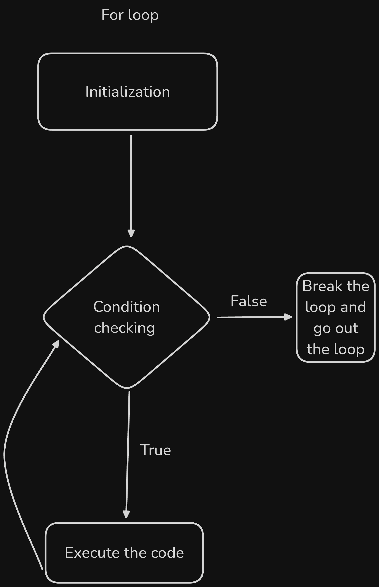
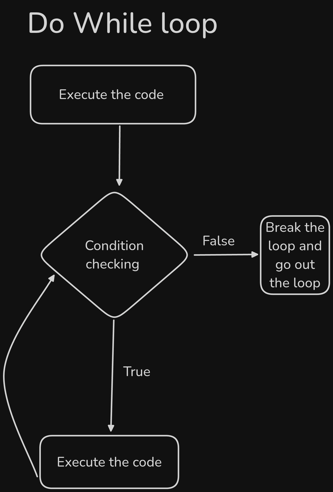
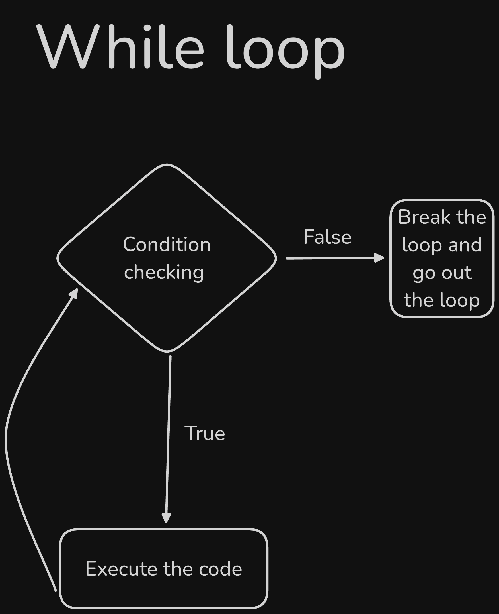

# Day 5 Tasks complete!

## ✅ 1. Generate a Pyramid Pattern using Nested Loop as it is shown below:

```bash
*
* *
* * *
* * * *
* * * * *
```
> ## Solved!

```js
for (let i = 1; i <= 5; i++) {
  let x = "";
  for (let j = 1; j <= i; j++) {
    x += "* ";
  }
  console.log(x);
}
```
> ### The output is :

```sh
*
* *
* * *
* * * *
* * * * *
```
___
<br />

## ✅ 2. Craete Multiplication Table (Using for loop)
Write a program to print the multiplication table of a given number up to 10.
For Example: If N = 3, output should be:

```bash
3 x 1 = 3
3 x 2 = 6
...
3 x 10 = 30
```

> ## Solved!

```js
let n = 5;
for(let i = 1; i <=10; i++){
  console.log(`${n} × ${i} = ${n * i}`)
};
```
> ### The output is :

```sh
5 × 1 = 5
5 × 2 = 10
5 × 3 = 15
5 × 4 = 20
5 × 5 = 25
5 × 6 = 30
5 × 7 = 35
5 × 8 = 40
5 × 9 = 45
5 × 10 = 50
```
___
<br />

## ✅ 3. Find the summation of all odd numbers between 1 to 500 and print them on the console log.

> ## Solved!

```js
let sum = 0;
for (let i = 1; i <= 500; i++ ){
  if (i % 2 !== 0) {
    sum += i;
  }
}
console.log(sum);
```
> ### The Output is:

```sh
62500
```
___
<br />

## ✅ 4. Skipping Multiples of 3
Write a program to print numbers from 1 to 20, but skip multiples of 3.

> ## Solved!

```js
for (let i = 1; i <= 20; i++) {
  if (i % 3 === 0) continue;
  console.log(i);
}
```
> ### The Output is:

```sh
1
2
4
5
7
8
10
11
13
14
16
17
19
20
```
___
<br />

## ✅ 5. Reverse Digits of a Number (Using while loop)
Write a program to reverse the digits of a given number using a while loop.

Example:

```bash
Input: 6789
Output: 9876
```

> ## Solved!

```js
let num = 6789;
let convertedNum = num.toString();
let i = convertedNum.length - 1;
let reversedNum = "";
while (i >= 0) {
  reversedNum += convertedNum.charAt(i);
  i--;
}
console.log(parseInt(reversedNum));
}
```
> ### The Output is:

```sh
9876
```
___
<br />

## ✅ 6. Write your understanding on the difefrences between for, while, and do-while loop. Create their flow charts.

<br /><br /><br />

<br /><br /><br />
