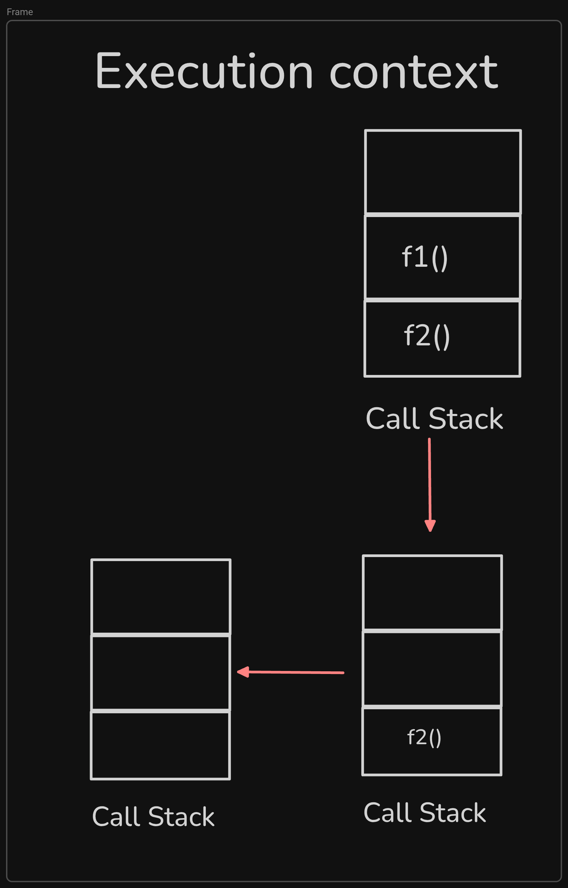

# Day 6 Tasks Complete!

## ✅ 1. Write a Function to Convert Celsius to Fahrenheit
Create a function celsiusToFahrenheit(celsius) that converts a temperature from Celsius to Fahrenheit.
Formula: (Celsius * 9/5) + 32 = Fahrenheit
> ## Solved!

```js
function celsiusToFahrenheit(celsius=1) {
  const fahrenheit = (celsius * 9/5) + 32 ;
  return fahrenheit;
}
let covertedFahrenheit = celsiusToFahrenheit(6);
console.log(covertedFahrenheit)
```
___
<br />

## ✅ 2. Create a Function to Find the Maximum of Two Numbers
Write a function findMax(num1, num2) that returns the larger of the two numbers. It should work for negative numbers as well.

> ## Solved!

```js
function findMax(num1 = 0, num2 = 0){
  let maxNum = (num1 > num2) ? num1 : num2;
  return maxNum;
}
console.log(findMax(4,8));
```
___
<br />


## ✅ 3. Function to Check if a String is a Palindrome
Create a function isPalindrome(str) that checks if a given string is a palindrome (reads the same forward and backward). You can not use any string function that we have not learned in the series so far.

> ## Solved!

```js
function isPalindrome(string) {
  let reversedString = "";
  for (let i = string.length - 1; i >= 0 ; i--) {
    reversedString += string.charAt(i);
  };
  if (string === reversedString) {
    return true;
  } else {
    return false;
  }
}
console.log(isPalindrome("eye"));  // true
console.log(isPalindrome("print"));  // false
```
___
<br />


## ✅ 4. Write a Function to Find Factorial of a Number
Create a function factorial(n) that returns the factorial of n.
Example 5! = 5 * 4 * 3 * 2 * 1

> ## Solved!

```js
function factorial(n) {
  let factorials = 1;
  for (let i = 1; i <= n; i++) {
    factorials *= i;
  }
  return factorials;
}

console.log(factorial(3)); // 6
console.log(factorial(4)); // 24
```
___
<br />

## ✅ 5. Write a function to Count Vowels in a String
Write a function countVowels(str) that counts the number of vowels (a, e, i, o, u) in a given string.

> ## Solved!

```js
function countVowels(str){
  let count = 0;
  for (let i = 0; i <= str.length -1 ; i++) {
   let x = str.charAt(i).toLowerCase();
   switch (x) {
     case "a" :
     case "e" :
     case "i" :
     case "o" :
     case "u" :
      count++;
   }
   
};
    return count;
}
const retVal = countVowels("Dhaka - Chaina");
console.log(retVal);
```
___
<br />


## ✅ 6. Write a Function to Capitalize the First Letter of Each Word in a Sentence
Write a function capitalizeWords(sentence) that takes a sentence and capitalizes the first letter of each word. You can use the toUpperCase() method of string to convert the lowercase to uppercase.

> ## Solved!

```js

// 1. extract the sentence into an array of words
// 2. extract the words into an array of letter
// 3. I will change first of the letter into the capital one.
// 4. Then i will join the all letters with `join` method in word
// 5. Then I will join the word with `join` method in the sentence.

function capitalizeWords(sentence) {
  
  // 1st step
  let words = sentence.split(" ");
  
    // 2nd step
  let letters = [];
  for (let i = 0; i <= words.length - 1; i++) {
    letters.push(words[i].split(""));
  }
  
  // 3rd step
  letters.forEach((array) => {
    array[0] = array[0].toUpperCase();
  });
  
  // 4th step
  for (let i = 0; i <= letters.length - 1; i++) {
    letters[i] = letters[i].join("");
  };
  
  // 5th step
 words = letters.join(" ");
 
  return words;
}
const capitalized = capitalizeWords("hello from javascript!");

console.log(capitalized);
```
___
<br />


## ✅ 7. Use an IIFE to Print “Hello, JavaScript!”
Write an IIFE that prints "Hello, JavaScript!" to the console. Here the Second word must be supplied using paramneter and argument.

> ## Solved!

```js
(function(name){
  console.log("Hello, " + name + "!")
})("JavaScript");
```
___
<br />


## ✅ 8. Create a Simple Callback Function
Write a function greet(name, callback), where callback prints a message using the name parameter.

> ## Solved!

```js
function greet(name, callback){
  callback(name);
};
greet("Farhan", (n) => {
  console.log("Hello " + n);
})

```
___
<br />


## ✅ 9. Create Call Stack Execution Diagram for this flow

```js
function f1() {}
function f2() {
    f1();
}
f2();
```



___
<br />


## ✅ 10. Create Call Stack Execution Diagram for this flow

```js
function f1() {}
function f2() {}
function f3() {
    f1();
}
f2();
f3();
f1();
```
# Flow charts
> ## When call f2()

.png)
> ## When call f3()

.png)

> ## When call f1()

.png)